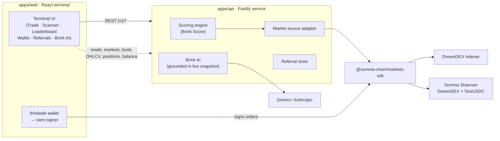

<div align="center">
  

  # Brink Markets

  **Discovery + execution terminal for on-chain event contracts.**

  *Find the edge. Trade the brink.*
</div>

---

## Overview

Brink Markets is a non-custodial trading terminal for **binary event contracts** — short-form prediction markets like *"Will BTC close at or above its opening price?"* — that trade on **DreamDEX** on the **Somnia** network. A YES share is worth **$1** if the event resolves true and **$0** if it doesn't; the price you pay (0–100¢) is the market's live implied probability.

Most prediction-market front-ends are either a raw order book or a wall of markets. Brink is built around one idea: **surface the few markets worth trading, then let you trade and settle them without ever handing over a key.** It reads real on-chain liquidity, scores every live market for tradeability, marks your positions to fair value, and signs every write in your own wallet.

There is **no Brink database of prices, no synthetic feed, and no custody**. Everything you see is either live indexer data, a value read straight off the chain, or a write your wallet signed.

## Key Design: The Brink Score

A prediction venue can list hundreds of markets, most of which are untradeable at any given moment — locked, expiring, one-sided, or stale. Naively showing all of them buries the handful that are actually executable.

Brink solves this with a **transparent tradeability score** computed server-side over the live book. Every market is graded 0–100 from real signals, and the exact reasons are returned alongside the number — nothing is a black box:

| Signal | Weight | Meaning |
|---|---:|---|
| Trading on-chain | 35 | Market is open (not locked/resolved) |
| Expiry headroom | 20 | ≥ 45s of runway before it closes |
| Fresh two-sided book | 15 | A valid book observed within 15s |
| Tight spread | 0–15 | `clamp(15 − spread¢, 0, 15)` |
| Volume | 0–10 | `clamp(log₁₀(volume) × 3, 0, 10)` |
| Trade count | 0–5 | `clamp(log₁₀(trades) × 2, 0, 5)` |

A market is flagged **Tradeable** only when it is Trading on-chain **and** has ≥ 45s left **and** a fresh book **and** a resting ask. The score and the `reasons[]` array are the same data the terminal, the Scanner, and Brink AI all read — one honest source of truth.

## Data & Trust Model

The design draws a hard line between what is real/live and what is convenience state, and never blurs it:

**Live, on-chain, or indexed (the real numbers):**
- Markets, order books, OHLCV candles, and 24h volume
- Your fills, open orders, and outcome-token balances
- Your testnet USDC trading balance and native STT (gas)
- The leaderboard (aggregated from real maker/taker fills across markets)
- Position value and unrealized P&L (marked to the live mid price)

**Server-side only (never shipped to the browser):**
- The Brink AI provider key (Gemini or Anthropic)
- Referral attribution (per-wallet codes + counts)

**Per-viewer, local (`localStorage`):**
- Notification, density, motion, and sound preferences — **scoped per wallet address**
- Display name and avatar

**Non-custodial, always:** Brink holds no private keys and can move no funds. Every order, cancel, close, and redeem is a transaction **your wallet signs**. Discovery is read-only; nothing that touches money happens until a wallet is connected.

## Architecture

Brink is an npm-workspaces monorepo: a Vite/React terminal and a Fastify service, with the chain reached through the DreamDEX markets SDK.



**Components and their responsibilities:**

- **`apps/web` — the terminal.** React 18 + Vite + Tailwind v4. Trade view (TradingView price chart ⇄ odds chart with your buy/sell markers), Scanner, Leaderboard, Wallet (balance, positions + P&L, redeem/close), Referrals, and Brink AI. Wallet connection and signing run through thirdweb → a viem wallet client.
- **`apps/api` — the read/compute layer.** A stateless Fastify service that fetches live markets, computes the Brink Score, serves OHLCV, aggregates the leaderboard, tracks referrals, and proxies Brink AI. It never signs anything and holds no keys beyond the AI provider key.
- **Scoring engine (`domain/scoring.ts`)** — pure functions that turn a raw market + book into a scored, reasoned, tradeable/not verdict.
- **Market source adapter (`adapters/market-source.ts`)** — the single seam to `@somnia-chain/markets-sdk`. Fetches markets, on-chain status, order books (fanned out in parallel), OHLCV, and fill tapes. Swappable and contract-testable.
- **Trade layer (`web/src/lib/trade.ts`)** — builds a per-account `SomniaMarkets` exchange bound to the wallet's viem signer; places/cancels orders, reads positions with avg-cost P&L, and redeems winners.
- **Brink AI (`domain/brink-ai.ts`)** — a provider-flexible LLM assistant, grounded strictly in a JSON snapshot of the current live markets so it can't fabricate prices.

## How Trading Works

Event contracts settle in the market's collateral token (**testnet USDC**), and the full lifecycle is on-chain:

1. **Fund** — STT for gas + testnet USDC for trading, from the Somnia faucet.
2. **Open** — Buy YES or Sell at a limit price. Two order types:
   - **IOC** (immediate-or-cancel): crosses the book and fills now, cancelling any remainder.
   - **GTC** (good-till-cancelled): rests on the book and appears in Open Orders until filled or cancelled.
   - The first order on a new collateral requires an ERC-20/6909 **approval** (a second wallet signature); subsequent orders are single-signature.
3. **Hold** — Your USDC moves into the position; the terminal marks it to the **mid price** and shows live unrealized P&L. Your buys/sells are drawn on the odds chart with an average-entry line.
4. **Exit** — two ways to realize:
   - **Close** — sell your shares back into the book (IOC at the bid) to bank your P&L **anytime**, win or lose.
   - **Redeem** — after the market resolves, burn winning shares for **$1 each** in collateral.

Profit = `(exit price − entry price) × shares`, realized the moment you Close or Redeem.

## Brink AI

Brink AI answers natural-language questions about the live feed — *"which markets clear every gate?"*, *"explain the top market's score"* — from a **real snapshot of current markets**, never invented data. The provider is chosen by which key is present:

- `GEMINI_API_KEY` → **Google Gemini** (free tier) — the default.
- `ANTHROPIC_API_KEY` → **Anthropic Claude** — used only if no Gemini key is set.
- Neither → an offline deterministic heuristic over the same feed, so the assistant is never dead.

The key lives only on the server; the browser only ever calls `POST /v1/ai`.

## Security & Operations

- **Non-custodial by construction** — no server-side signer, no key custody, no ability to move user funds.
- **Read-only API** — the Fastify service only reads and computes; every state change is a wallet-signed on-chain transaction.
- **Key isolation** — the AI provider key is server-only and never reaches the client bundle. Secrets are `.env`, git-ignored.
- **Hardened responses** — CORS is explicit (any localhost origin in dev), and every response carries `nosniff`, `DENY` framing, `no-referrer`, and `no-store`.
- **Graceful degradation** — if the indexer is slow or a single market's read fails, that market drops rather than sinking the feed; if the AI has no key, the heuristic answers.

## Tech Stack

| Layer | Stack |
|---|---|
| Frontend | React 18, Vite 5, TypeScript (strict), Tailwind CSS v4, framer-motion, react-router v6 |
| Wallet | thirdweb v5 → viem signer (Somnia Shannon, chain 50312) |
| Charts | TradingView Advanced Chart (underlying) + Lightweight Charts (odds + volume) |
| Backend | Node 22, Fastify 5, zod, dotenv |
| Chain SDK | `@somnia-chain/markets-sdk` (DreamDEX) |
| AI | Google Gemini (REST) · Anthropic Claude (SDK, optional) |
| Tooling | npm workspaces, Vitest, tsc |

## API Reference

| Method | Endpoint | Purpose |
|---|---|---|
| `GET` | `/health` | Liveness |
| `GET` | `/v1/markets` | Scored live markets (`asset`, `minScore`, `tradeableOnly`, `limit`) |
| `GET` | `/v1/markets/:marketId` | One scored market |
| `GET` | `/v1/ohlcv` | Odds candles (`symbol`, `tf`, `limit`) |
| `GET` | `/v1/leaderboard` | Traders ranked by real filled volume (`limit`) |
| `GET` | `/v1/referrals/:address` | A wallet's referral code + live stats |
| `POST` | `/v1/referrals/claim` | Record `{ address, code }` attribution |
| `GET` | `/v1/ai/status` | Whether an AI provider key is configured |
| `POST` | `/v1/ai` | Ask Brink AI `{ question, history }` |

## Running Locally

```bash
# 1. Install
npm install

# 2. Configure — copy .env.example to .env and set:
#    GEMINI_API_KEY=...            (free key: https://aistudio.google.com/apikey)
#    apps/web/.env → VITE_THIRDWEB_CLIENT_ID=...  (wallet connect)

# 3. Run — two terminals
npm run dev:api      # Fastify on 127.0.0.1:8787 (serves /v1/*, real Somnia data)
npm run dev:web      # Vite terminal on 5173

# 4. Verify
npm test             # scoring suite
npm run build:api && npm run build:web
```

Open the terminal, connect a wallet, switch to **Somnia Shannon**, fund from the faucet, and trade.

## Deployment

- **Frontend → Vercel** — static Vite build (`npm run build:web`); set `VITE_API_BASE_URL` to the API URL and `VITE_THIRDWEB_CLIENT_ID`.
- **Backend → Railway** — Node service (`npm run build:api` → `node apps/api/dist/server.js`); set `GEMINI_API_KEY`, `CORS_ORIGIN` (the Vercel domain), and bind `API_HOST=0.0.0.0` with the platform `PORT`.

## Testing & Verification

- Scoring engine covered by a **Vitest** suite (tradeable gates, spread, staleness, expiry headroom).
- `tsc --noEmit` (strict) and production builds gate every change.
- Live on **Somnia Shannon testnet** with faucet assets. **No third-party audit yet.**

## Current Limitations

- **Testnet only** — trades settle in freely-mintable TestUSDC with no real-world value.
- **Referral store is in-memory** — codes and counts are real per running instance but reset on restart; production needs a persistent store.
- **Self-audited** — no external security review yet.
- **Shared liquidity** — Brink is a front-end over on-chain DreamDEX markets, so the leaderboard reflects all traders on those markets, not a Brink-exclusive cohort.

## Key Facts

| Metric | Value |
|---|---|
| Network | Somnia Shannon (chainId 50312) |
| Collateral | TestUSDC (faucet) |
| Instrument | Binary event contracts (YES/NO, 0–100¢, $1 settlement) |
| Order types | IOC (fill-or-cancel), GTC (resting) |
| Tradeability score | 0–100, transparent + reasoned |
| Custody | None — wallet signs every write |
| Market read latency | ~1–2s (parallel book fetch) |

---

<div align="center">
  <sub>Brink Markets · event contracts on Somnia · testnet</sub>
</div>
